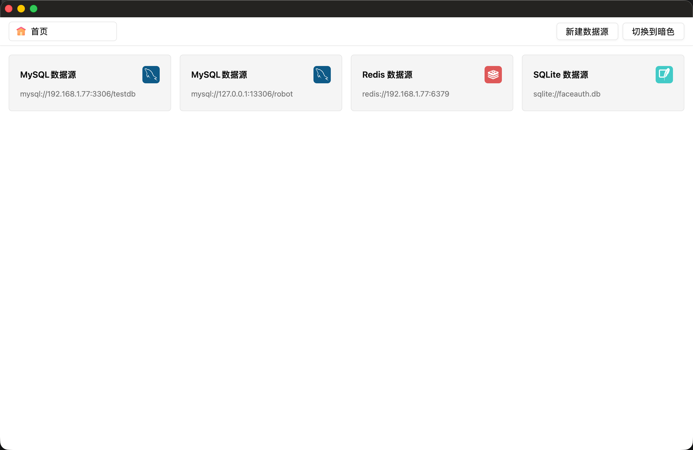
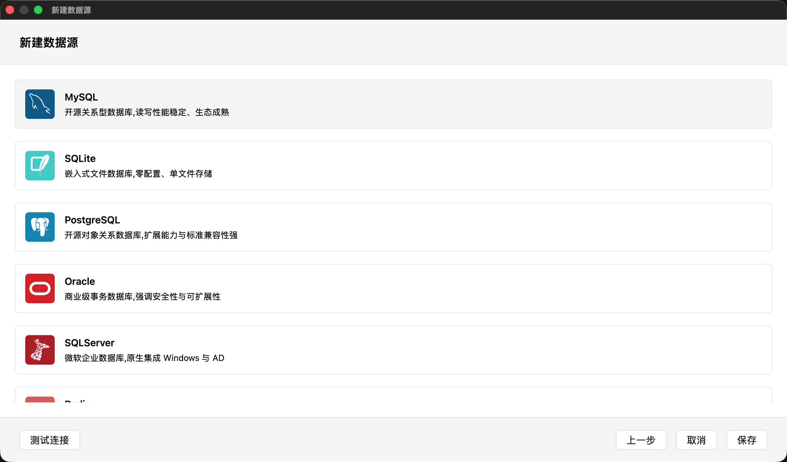
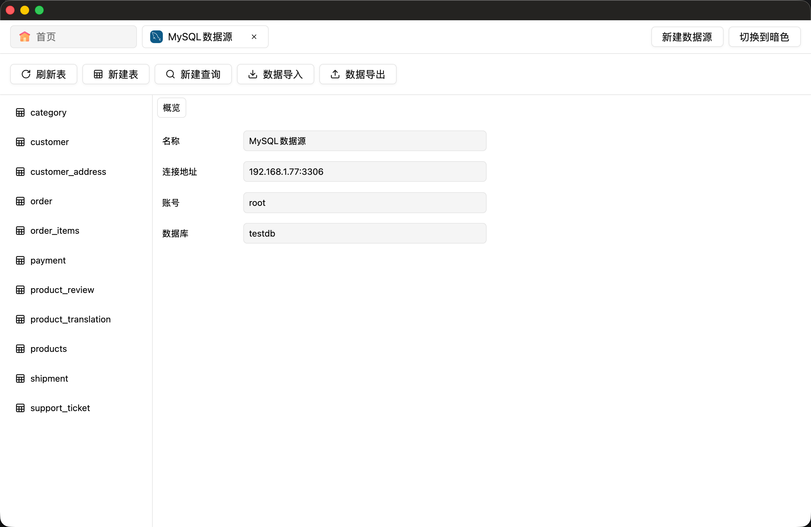
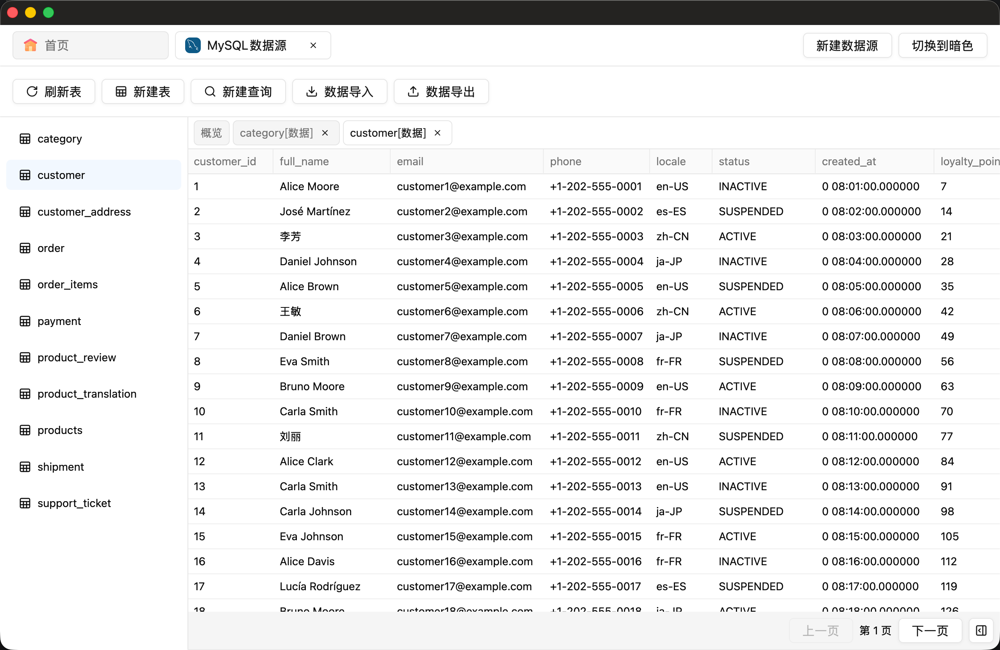
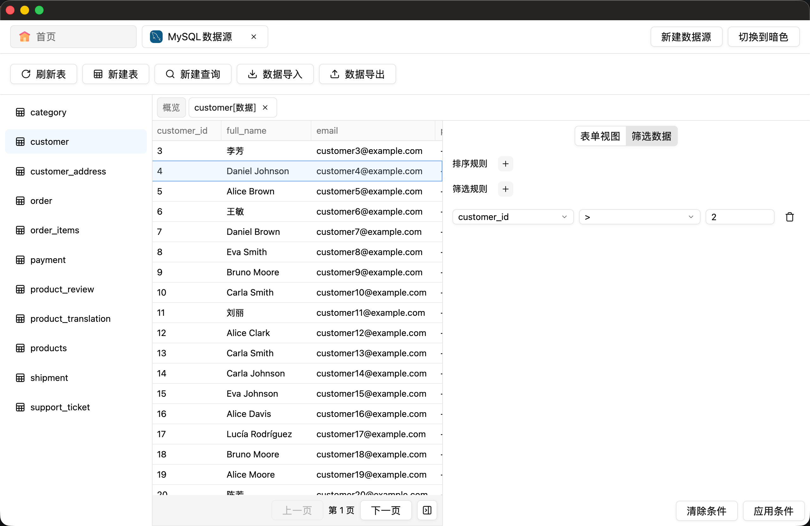
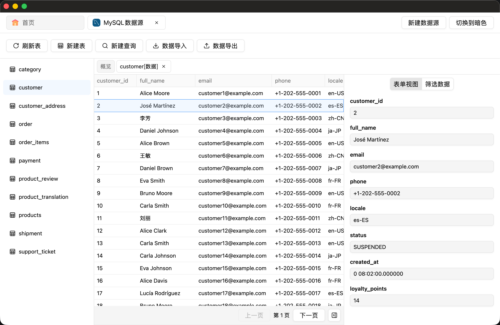
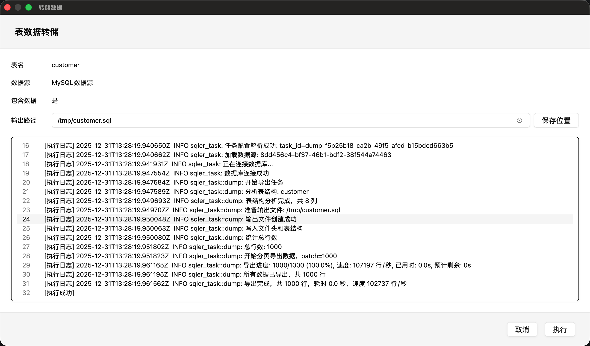

<div align="center">

# Sqler

**现代化的跨平台数据库管理工具**

使用 Rust + GPUI 构建的高性能桌面应用，支持多种数据库类型

[功能特性](#-功能特性) • [快速开始](#-快速开始) • [界面预览](#-界面预览) • [技术架构](#-技术架构) • [开发路线](#-开发路线)

</div>

---

## ✨ 功能特性

### 多数据库支持

支持 7 种主流数据库，统一的操作界面：

| 数据库            | 状态     | 查询              | 表管理 | 导入导出 |
|----------------|--------|-----------------|-----|------|
| **MySQL**      | ✅ 全功能  | ✅ SQL + Builder | ✅   | 🚧   |
| **PostgreSQL** | ✅ 全功能  | ✅ SQL + Builder | ✅   | 🚧   |
| **SQLite**     | ✅ 全功能  | ✅ SQL + Builder | ✅   | 🚧   |
| **Redis**      | ✅ 全功能  | ✅ Command       | ✅   | -    |
| **MongoDB**    | ✅ 全功能  | ✅ Document      | ✅   | -    |
| **Oracle**     | 📋 计划中 | -               | -   | -    |
| **SQL Server** | 📋 计划中 | -               | -   | -    |

### 核心功能

- **🔐 安全存储**：数据源配置使用 AES-256-GCM 加密存储
- **📊 数据查询**：支持 SQL 编辑器、可视化查询构建器、分页浏览
- **🔍 筛选排序**：可视化筛选条件、多字段排序、实时预览
- **📝 表单视图**：行数据表单编辑、字段详情查看
- **💾 数据传输**：支持 CSV/JSON/SQL 格式的导入导出（开发中）
- **🎨 主题切换**：支持亮色/暗色主题
- **⚡️ 高性能**：基于 GPUI 的 GPU 加速渲染
- **🗂️ 多标签页**：支持同时管理多个数据源和查询

### 技术亮点

- **Workspace 架构**：核心库（sqler-core）与 UI 层（sqler-app）完全分离
- **统一接口**：通过 trait 抽象消除不同数据库的方言差异
- **连接复用**：智能连接管理，支持跨线程使用
- **参数化查询**：自动处理 SQL 注入防护和标识符转义
- **智能列宽**：根据字符类型（中文/英文/数字）自动计算最佳列宽
- **缓存系统**：本地缓存表信息和查询历史，提升响应速度

---

## 🚀 快速开始

### 系统要求

- Rust 1.75+ (Edition 2024)
- macOS / Linux / Windows
- 数据库驱动依赖（根据使用的数据库类型）

### 编译运行

```bash
# 克隆仓库
git clone https://github.com/your-username/sqler.git
cd sqler

# 编译并运行
cargo run

# 发布版本编译（优化性能）
cargo build --release
./target/release/sqler
```

### 配置说明

应用程序首次运行时会自动创建配置目录：

```
~/.sqler/
├── sources.db          # 加密的数据源配置
├── logs/               # 应用日志文件
└── cache/              # 缓存数据
    └── {uuid}/
        ├── tables.json # 表信息缓存
        └── queries.json# 保存的查询
```

---

## 📸 界面预览

### 首页 - 数据源管理



网格卡片展示所有数据源，双击卡片即可打开对应的工作区。

### 新建数据源



支持 7 种数据库类型，提供测试连接功能，配置信息加密存储。

### 数据源概览



显示数据源连接信息、数据库配置详情。

### 数据表查看



支持分页浏览（每页 500 行）、动态列宽调整、列拖拽排序。

### 筛选和排序



可视化筛选规则、支持多字段组合条件、实时应用到查询。

### 表单视图



以表单形式查看和编辑单行数据，支持字段详情面板。

### 数据转储



支持导出为 CSV/JSON/SQL 格式（开发中）。

---

## 🏗️ 技术架构

### 技术栈

| 类型        | 技术                                                                   |
|-----------|----------------------------------------------------------------------|
| **语言**    | Rust (Edition 2024)                                                  |
| **UI 框架** | [GPUI 0.2.2](https://www.gpui.rs/) - GPU 加速 UI 框架                    |
| **组件库**   | [gpui-component 0.5.0](https://github.com/longbridge/gpui-component) |
| **数据库驱动** | mysql, postgres, rusqlite, mongodb, redis                            |
| **加密**    | AES-256-GCM (aes-gcm)                                                |
| **日志**    | tracing + tracing-appender                                           |

### 项目结构

采用 Cargo Workspace 架构，职责清晰分离：

```
sqler/
├── Cargo.toml              # Workspace 根配置
├── crates/
│   ├── sqler-core/         # 核心库 (3,145 行)
│   │   ├── src/
│   │   │   ├── lib.rs      # 数据模型定义
│   │   │   ├── driver/     # 数据库驱动抽象
│   │   │   └── cache/      # 缓存系统
│   │   └── Cargo.toml
│   ├── sqler-app/          # 应用程序 (6,248 行)
│   │   ├── src/
│   │   │   ├── main.rs     # 应用入口
│   │   │   ├── app/        # 应用层逻辑
│   │   │   ├── workspace/  # 工作区视图
│   │   │   ├── create/     # 数据源创建
│   │   │   └── transfer/   # 数据导入导出
│   │   ├── assets/         # 静态资源
│   │   └── Cargo.toml
│   └── sqler-task/         # 任务执行器
└── docs/
    ├── CODEMAP.md          # 完整代码地图
    └── screenshots/        # 界面截图
```

**依赖关系**：
- `sqler-app` 依赖 `sqler-core`（单向依赖，无循环）
- `sqler-core` 可独立编译和测试
- 编译产物：单个二进制 `sqler`

### 核心设计

#### 1. Trait 驱动架构

```rust
pub trait DatabaseDriver {
    fn check_connection(&self, config: &Self::Config) -> Result<(), DriverError>;
    fn create_connection(&self, config: &Self::Config) -> Result<Box<dyn DatabaseSession>, DriverError>;
}

pub trait DatabaseSession: Send {
    fn exec(&mut self, req: ExecReq) -> Result<ExecResp, DriverError>;
    fn query(&mut self, req: QueryReq) -> Result<QueryResp, DriverError>;
    fn tables(&mut self) -> Result<Vec<TableInfo>, DriverError>;
    fn columns(&mut self, table: &str) -> Result<Vec<ColumnInfo>, DriverError>;
}
```

**优势**：
- 统一接口消除数据库方言差异
- 支持 SQL、文档、命令三种查询模式
- `DatabaseSession: Send` 支持跨线程使用

#### 2. 连接复用策略

```rust
pub struct CommonWorkspace {
    session: Option<Box<dyn DatabaseSession>>,
    // ...
}
```

- 延迟建立：首次查询时才创建连接
- 连接复用：通过 `session.take()` 移动到后台线程，查询完成后归还
- 失败重试：连接失败时自动重建

#### 3. 缓存系统

```rust
pub struct AppCache {
    sources: Vec<DataSource>,     // 数据源列表
    sources_path: PathBuf,        // ~/.sqler/sources.db
    sources_cache: PathBuf,       // ~/.sqler/cache/
}

pub type ArcCache = Arc<RwLock<AppCache>>;
```

- **Arc<RwLock<>>**：支持跨线程共享和并发读写
- **读写分离**：多个读者或单个写者
- **分离存储**：敏感数据加密（sources.db）+ 明文缓存（tables.json）

---

## 📖 功能说明

### 数据源管理

1. **新建数据源**：点击"新建数据源"按钮，选择数据库类型
2. **测试连接**：填写配置后，点击"测试连接"验证连接参数
3. **保存配置**：配置使用 AES-256-GCM 加密存储到 `~/.sqler/sources.db`
4. **打开工作区**：首页双击数据源卡片打开对应工作区

### 数据查询

#### SQL 查询（关系型数据库）
- 支持多语句执行（使用 `;` 分隔）
- 异步后台执行，不阻塞 UI
- 显示执行时间和影响行数
- 错误提示和语法高亮

#### 可视化查询构建器
- 选择表和字段
- 可视化筛选条件（支持 =, !=, >, <, LIKE, IN 等操作符）
- 多字段排序
- 分页浏览（每页 500 行）

#### Redis 命令
- 支持任意 Redis 命令
- 键浏览器（基于 `:` 分隔符的层级树）
- 显示键类型、TTL、大小

#### MongoDB 查询
- JSON 筛选条件输入
- 文档分页浏览
- 集合管理

### 数据传输（开发中）

- **导入**：CSV/JSON/SQL → 数据库表
- **导出**：数据库表 → CSV/JSON/SQL
- **导入模式**：替换、追加、更新、追加或更新、追加不更新

---

## 🗺️ 开发路线

### ✅ 已完成

#### 核心功能
- [x] 数据源管理（新建、测试连接、加密存储）
- [x] MySQL/PostgreSQL/SQLite 完整支持
- [x] Redis/MongoDB 基础支持
- [x] 多标签页管理
- [x] 主题切换（亮色/暗色）

#### 查询功能
- [x] SQL 编辑器（语法高亮、多语句执行）
- [x] 可视化查询构建器
- [x] 筛选和排序
- [x] 分页浏览（每页 500 行）
- [x] 表单视图

#### 系统功能
- [x] 日志系统（终端+文件双重输出）
- [x] 缓存系统（表信息、连接配置）
- [x] 连接复用机制

### 🚧 开发中

- [ ] 数据导入导出执行逻辑
- [ ] 数据编辑（单元格编辑、行增删）
- [ ] Redis 命令执行完整实现
- [ ] MongoDB 文档查询完整实现

### 📋 计划中

- [ ] Oracle 驱动实现
- [ ] SQL Server 驱动实现
- [ ] 查询历史和收藏
- [ ] 数据源编辑和删除
- [ ] 数据库结构可视化
- [ ] 性能监控
- [ ] 查询执行计划
- [ ] 键盘快捷键
- [ ] 右键菜单

---

## 🤝 贡献指南

### 代码规范

#### 导入顺序

```rust
// 1. 标准库
use std::sync::Arc;

// 2. 外部 crate（按字母顺序）
use gpui::{prelude::*, *};
use serde::{Deserialize, Serialize};

// 3. Workspace crate
use sqler_core::{
    DatabaseDriver, DriverError,
    DataSource, DataSourceKind,
};

// 4. 当前 crate（按模块分组）
use crate::{
    app::comps::DataTable,
    workspace::CommonWorkspace,
};
```

#### 数据源排序标准

所有涉及 `DataSourceKind` 的 match 语句必须遵循标准顺序：

```
MySQL → SQLite → Postgres → Oracle → SQLServer → Redis → MongoDB
```

#### 命名约定

- 结构体：大驼峰 `PascalCase`
- 函数/变量：蛇形 `snake_case`
- 常量：全大写蛇形 `UPPER_SNAKE_CASE`

### 提交流程

1. Fork 本仓库
2. 创建功能分支：`git checkout -b feature/your-feature`
3. 提交代码：`git commit -am 'Add some feature'`
4. 推送分支：`git push origin feature/your-feature`
5. 提交 Pull Request

### 测试

在 `docs/testdata/` 目录下提供测试数据脚本，确保：
- 每个数据库至少 10 张表
- 每表≥1000 行数据
- 覆盖常见数据类型和关系

---

## 📊 项目统计

| 项目             | 数值              |
|----------------|-----------------|
| **总代码行数**      | 9,393 行         |
| **Rust 文件**    | 31 个            |
| **sqler-core** | 3,145 行 (33.5%) |
| **sqler-app**  | 6,248 行 (66.5%) |
| **支持数据库**      | 7 种             |
| **UI 组件**      | 60+ 个           |

---

## 📄 许可证

MIT License

---

## 🙏 致谢

- [GPUI](https://www.gpui.rs/) - 强大的 GPU 加速 UI 框架
- [gpui-component](https://github.com/longbridge/gpui-component) - 丰富的组件库

---

<div align="center">

**[⬆ 回到顶部](#sqler)**

Made with ❤️ using Rust and GPUI

</div>
